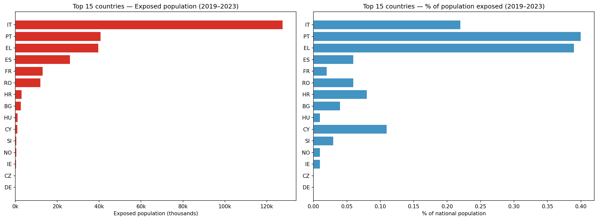
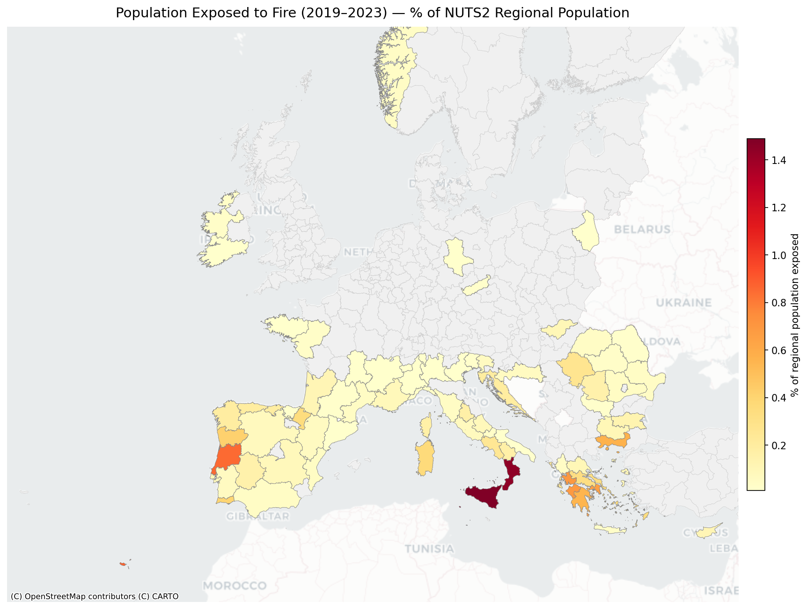

# Fire Population Exposure Analysis — Europe 2019–2023

Analysis of the population exposed to wildfires in Europe between 2019 and 2023, combining EFFIS burned area data with the Eurostat Census 2021 population grid. Results are broken down by age group, NUTS2 region, and country.

---

## Data Sources

### Fire perimeters — EFFIS MODIS Burned Area
- **Source:** European Forest Fire Information System (EFFIS) — Joint Research Centre (JRC)
- **Layer:** `modis.ba.poly` — individual burned area polygons detected by MODIS satellite
- **Coverage:** 2019–2023 (38,139 fire records)
- **CRS:** EPSG:4326

### Population grid — Eurostat Census 2021
- **Source:** [Eurostat Census Grid 2021 V2.2](https://ec.europa.eu/eurostat/web/gisco/geodata/population-distribution/geostat)
- **Resolution:** 1 km × 1 km grid
- **CRS:** EPSG:3035 (LAEA Europe)
- **Variables used:**
  | Code | Description |
  |---|---|
  | `T` | Total population |
  | `Y_LT15` | Population under 15 years |
  | `Y_1564` | Population aged 15–64 |
  | `Y_GE65` | Population aged 65 and over |

### Administrative boundaries — NUTS2 (2021)
- **Source:** Eurostat GISCO — NUTS 2021 Level 2 regions
- **Coverage:** 334 NUTS2 regions

---

## Methodology

1. **Filter** fire records to 2019–2023 (38,139 polygons).
2. **Dissolve** all fire polygons into a single `MultiPolygon` using a geometric union (`unary_union`). Areas burned in multiple years are counted only once, avoiding double-counting of population.
3. **Intersect** the dissolved fire extent with each NUTS2 region to obtain the burned sub-area per region.
4. **Zonal statistics** — sum Eurostat Census 2021 raster values (1 km grid) inside:
   - the dissolved fire extent → **exposed population**
   - each full NUTS2 region → **regional total population** (denominator for %)
5. **Aggregate** NUTS2 results to country level.

> **Note:** Population data are from the 2021 Census grid and are held constant across all fire years. The analysis measures the residential population living within burned areas, not displacement or casualties.

---

## Results

### Europe-wide summary

| Age group | Exposed population | EU total | % exposed |
|---|---|---|---|
| **Total** | 269,594 | 455,671,735 | 0.06% |
| Under 15 | 34,456 | 67,516,724 | 0.05% |
| 15 to 64 | 167,966 | 290,930,196 | 0.06% |
| **65+** | **67,225** | 94,262,657 | **0.07%** |

The elderly (65+) are proportionally the most exposed age group relative to their share of the EU population.

---

### Exposed population by age group


---

### Top countries by exposed population

| Country | Exposed | National total | % |
|---|---|---|---|
| Italy (IT) | 127,711 | 58,420,557 | 0.22% |
| Portugal (PT) | 40,753 | 10,257,175 | **0.40%** |
| Greece (EL) | 39,726 | 10,237,698 | 0.39% |
| Spain (ES) | 26,153 | 46,828,861 | 0.06% |
| France (FR) | 13,068 | 65,189,893 | 0.02% |
| Romania (RO) | 12,092 | 19,053,261 | 0.06% |
| Croatia (HR) | 3,095 | 3,786,907 | 0.08% |

Italy records the largest absolute number of exposed people; Portugal and Greece have the highest shares of their national population exposed.



---

### Fire map — burned areas 2019–2023

Colors indicate the year of the fire (yellow = 2019 → dark red = 2023). The dashed outline shows the dissolved extent used for population computation.


---

### NUTS2 choropleth — % of regional population exposed



#### Top NUTS2 regions by % exposed

| NUTS2 | Region | Country | Exposed | % of regional pop |
|---|---|---|---|---|
| ITG1 | Sicilia | IT | 70,559 | 1.49% |
| ITF6 | Calabria | IT | 25,923 | 1.44% |
| PT30 | Madeira | PT | 2,142 | 0.87% |
| PT16 | Centro | PT | 18,968 | 0.85% |
| EL30 | Attiki | GR | 25,036 | 0.66% |
| EL51 | Anatoliki Makedonia, Thraki | GR | 3,110 | 0.57% |
| EL64 | Sterea Elláda | GR | 1,642 | 0.33% |
| ITG2 | Sardegna | IT | 5,632 | 0.36% |

---

## Output Files

| File | Description |
|---|---|
| `output/fire_map_2019_2023.png` | Static map of burned areas by year |
| `output/population_exposed_chart.png` | EU-level exposed population by age group |
| `output/population_exposed_2019_2023.csv` | EU-level results table |
| `output/country_population_exposed.csv` | Per-country exposed population & % by age group |
| `output/nuts2_population_exposed.csv` | Per-NUTS2 exposed population & % by age group |
| `output/nuts2_choropleth_pct.png` | Choropleth map — % regional population exposed |
| `output/country_bar_chart.png` | Top 15 countries bar chart |

---

## Requirements

```bash
python -m venv venv
source venv/bin/activate
pip install geopandas rasterio rasterstats matplotlib contextily shapely
```

## Usage

```bash
# Step 1 — EU-level analysis + fire map
python fire_population_analysis.py

# Step 2 — Per-country and per-NUTS2 breakdown
python fire_population_nuts.py
```

---

## License

Population data © European Union 2025 — Eurostat Census Grid 2021.  
Fire perimeters © European Forest Fire Information System (EFFIS) — JRC.
