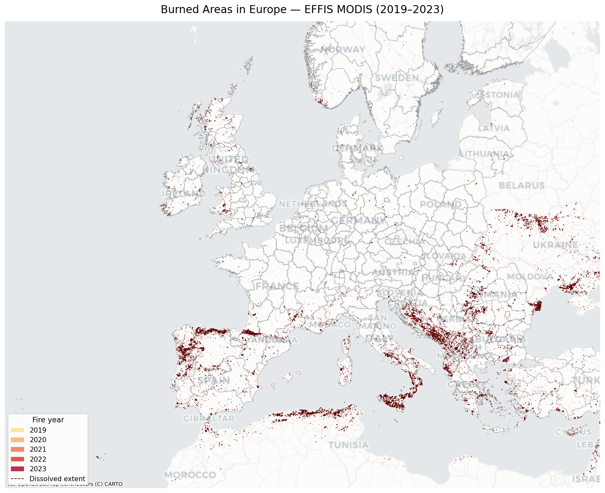
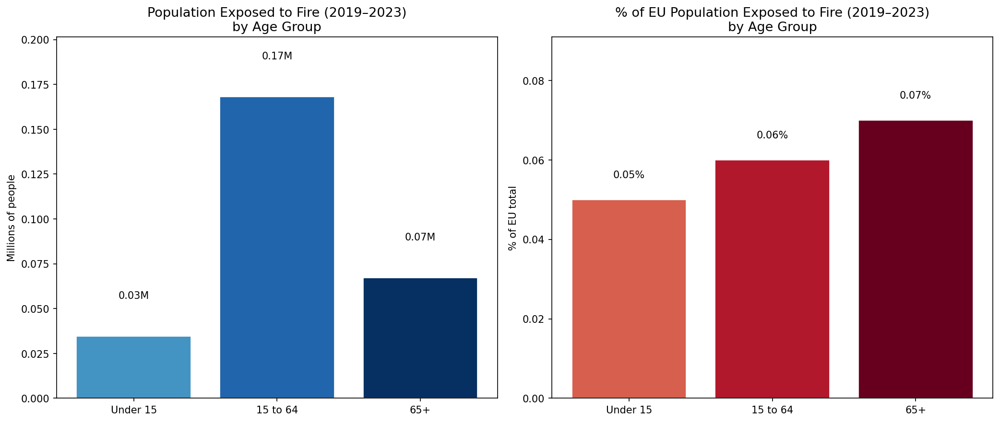
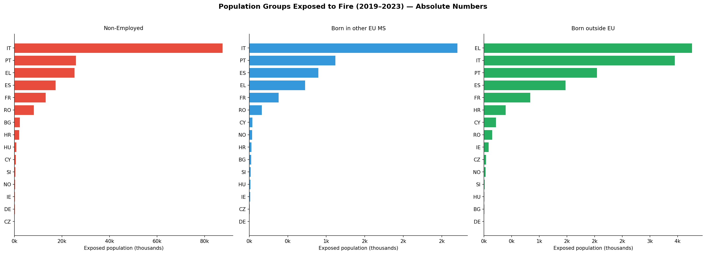
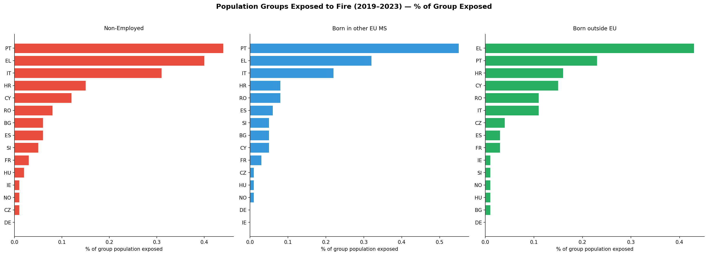
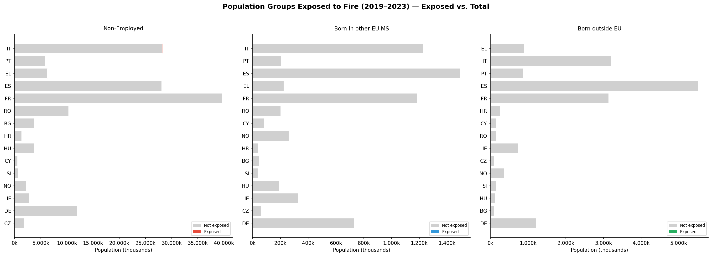
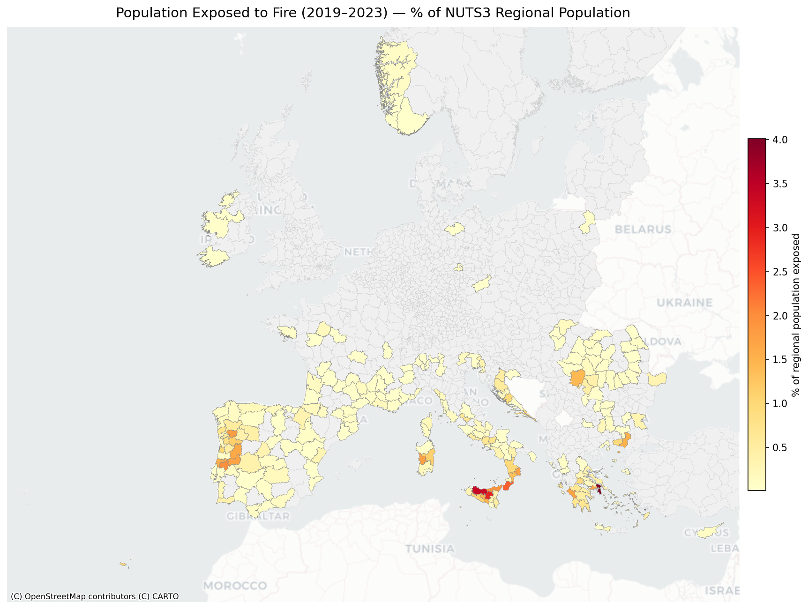

# Fire Population Exposure Analysis — Europe 2019–2023

## Goal

Wildfires are an increasing threat across Europe, with severe seasons recorded between 2019 and 2023. This project quantifies **how many people — and which population groups — were exposed to wildfires** across Europe during this period, at both country and sub-national (NUTS3) level.

The analysis combines satellite-derived burned area data from the European Forest Fire Information System (EFFIS) with the Eurostat 2021 Census population grid, allowing exposure to be broken down not only by geography but also by **age, employment status, and country of birth**.

---

## Data

### Fire perimeters — EFFIS MODIS Burned Area
- **Source:** European Forest Fire Information System (EFFIS) — Joint Research Centre (JRC)
- **Layer:** `modis.ba.poly` — individual burned area polygons detected by MODIS satellite
- **Coverage:** 2019–2023 (38,139 fire records across Europe)
- **CRS:** EPSG:4326

### Population grid — Eurostat Census 2021
- **Source:** [Eurostat Census Grid 2021 V2.2](https://ec.europa.eu/eurostat/web/gisco/geodata/population-distribution/geostat)
- **Resolution:** 1 km × 1 km grid cells
- **CRS:** EPSG:3035 (LAEA Europe)
- **Variables used:**

| Code | Description |
|---|---|
| `T` | Total population |
| `Y_LT15` | Population under 15 years |
| `Y_1564` | Population aged 15–64 |
| `Y_GE65` | Population aged 65 and over |
| `EMP` | Employed persons |
| `EU_OTH` | Born in another EU Member State |
| `OTH` | Born outside the EU |

### Administrative boundaries — NUTS3 (2021)
- **Source:** Eurostat GISCO — NUTS 2021 Level 3 regions
- **Coverage:** 1,514 NUTS3 regions across Europe

---

## Methods

### 1. Fire aggregation

The 38,139 individual fire polygons recorded between 2019 and 2023 are **dissolved into a single MultiPolygon** using a geometric union (`unary_union`). This is a key methodological choice: areas burned in multiple years are counted only once, avoiding double-counting of the resident population. The map below shows the individual fire events by year, while the dissolved union forms the spatial mask used for all population calculations.



*Colors indicate the year of the fire (yellow = 2019 → dark red = 2023).*

### 2. Population exposure

For each NUTS3 region, the analysis proceeds in three steps:

1. **Clip** the dissolved fire extent to the NUTS3 boundary to obtain the burned sub-area within that region.
2. **Zonal statistics** — sum the Census 2021 raster values (1 km grid) inside the clipped fire area → **exposed population**.
3. **Zonal statistics** on the full NUTS3 extent → **regional total population** (denominator for exposure %).

Results are then aggregated to country level by summing across NUTS3 regions.

> **Note:** Population data are from the 2021 Census grid and are held constant across all fire years. The analysis measures the residential population living within burned areas, not displacement or casualties.

---

## Results

### European-level statistics

Across Europe, approximately **270,000 people** lived within areas burned at least once between 2019 and 2023 — around 0.1% of the total population covered by the analysis.

| Group | Exposed | Total (fire-affected NUTS3) | % exposed |
|---|---|---|---|
| **Total population** | 269,558 | 254,139,152 | 0.11% |
| Non-employed | 183,864 | 170,198,468 | 0.11% |
| Born in other EU MS | 6,169 | 7,515,514 | 0.08% |
| Born outside EU | 12,485 | 19,711,936 | 0.06% |

Non-employed persons (which include unemployed, inactive, students and retired people not captured by the EMP variable) show a slightly higher exposure rate than the general population, reflecting the geographic concentration of fires in southern European regions where employment rates tend to be lower.



---

### Country-level statistics and charts

The exposure is heavily concentrated in **southern Europe**. Italy records the largest absolute number of exposed people (127,711), while Portugal and Greece show the highest share of their national population exposed (~0.40% and ~0.39% respectively).

| Country | Exposed (total) | National pop (fire NUTS3) | % exposed | % non-employed exposed |
|---|---|---|---|---|
| Italy (IT) | 127,711 | 46,198,432 | 0.28% | 0.31% |
| Portugal (PT) | 40,753 | 10,257,175 | 0.40% | 0.44% |
| Greece (EL) | 39,726 | 10,103,290 | 0.39% | 0.40% |
| Spain (ES) | 26,153 | 46,360,139 | 0.06% | 0.06% |
| France (FR) | 13,068 | 39,656,919 | 0.03% | 0.03% |
| Romania (RO) | 12,092 | 16,794,904 | 0.07% | 0.08% |
| Croatia (HR) | 3,095 | 2,226,350 | 0.14% | 0.15% |
| Bulgaria (BG) | 2,703 | 6,345,746 | 0.04% | 0.06% |
| Cyprus (CY) | 1,055 | 917,722 | 0.11% | 0.12% |

**Absolute exposed population by group (top 15 countries)**



**% of each group exposed (top 15 countries)**



**Exposed vs. total group population by country**



---

### NUTS3 maps and regional breakdown

At NUTS3 level, the exposure is even more spatially concentrated. The five most exposed regions account for a disproportionate share of the total exposed population.

| NUTS3 | Region | Country | Exposed | Regional pop | % exposed |
|---|---|---|---|---|---|
| EL305 | Anatoliki Attiki | GR | 20,690 | 516,581 | 4.01% |
| ITG12 | Palermo | IT | 40,137 | 1,190,568 | 3.37% |
| ITG16 | Enna | IT | 4,647 | 157,858 | 2.94% |
| ITF65 | Reggio di Calabria | IT | 11,880 | 501,609 | 2.37% |
| PT16I | Médio Tejo | PT | 4,504 | 228,622 | 1.97% |



*Choropleth showing the percentage of each NUTS3 region's population exposed to fire (2019–2023). Grey regions had no recorded burned area during the period.*

---

## Conclusions

This analysis shows that wildfire exposure in Europe between 2019 and 2023 is geographically concentrated in **southern Europe** — particularly in Italy, Portugal, and Greece — with the highest relative exposure rates at the sub-regional level in Attica (Greece), Sicily, and Calabria (Italy).

When broken down by population group, **non-employed persons** and **people born outside the EU** show exposure rates broadly comparable to the general population in the most affected countries, but the small absolute numbers for some groups (particularly EU-born migrants) reflect their geographic concentration in urban and northern European regions less affected by fire.

The 1 km Census grid provides a robust spatial basis for this type of analysis, though two important limitations apply:
- Population data are fixed at 2021; seasonal and daily mobility are not captured.
- The MODIS burned area product may miss small fires or underestimate perimeters in areas with persistent cloud cover.

---

## Repository structure

```
fire_population_analysis.py   # EU-level analysis and fire map
fire_population_nuts.py       # NUTS2-level exposure analysis
fire_population_nuts3.py      # NUTS3-level exposure analysis (main script)
visualize_groups.py           # Group-level bar charts
output/                       # All figures and CSV results
data/                         # Not tracked — see Data section above
```

## Requirements

```bash
python -m venv venv
source venv/bin/activate
pip install geopandas rasterio rasterstats matplotlib contextily shapely
```

## Usage

```bash
# Extract fire perimeters
unzip effis_layer.zip -d /tmp/effis_shp

# EU-level analysis + fire map
python fire_population_analysis.py

# NUTS3 exposure analysis (includes country aggregation)
python fire_population_nuts3.py

# Group bar charts (non-employed, EU-born, non-EU-born)
python visualize_groups.py
```

---

## License

Population data © European Union 2025 — Eurostat Census Grid 2021.  
Fire perimeters © European Forest Fire Information System (EFFIS) — JRC.
